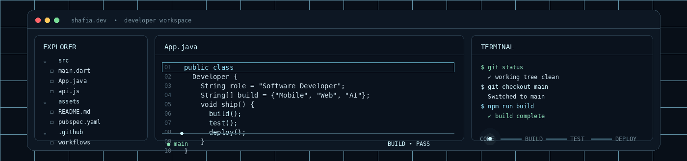
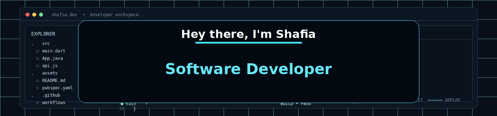
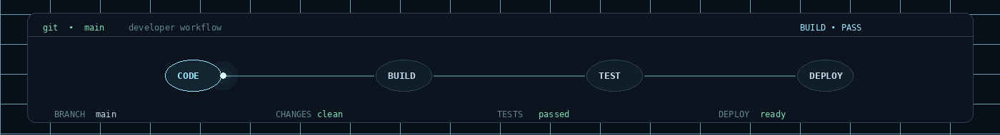
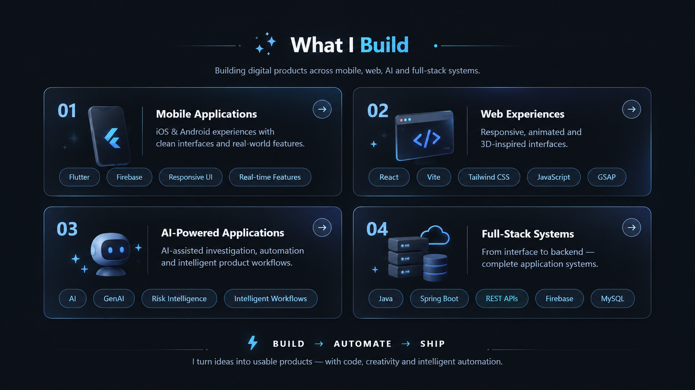

 

---

---

## 👩🏻‍💻 About Me

I'm a **Computer Science Engineering student and software developer** who enjoys building products that combine strong engineering with polished user experiences.

 

▸ 🎓 **BE in Computer Science Engineering**

▸ 💻 Strong focus on **Java, DSA and software engineering fundamentals**

▸ 📱 Built **Flutter + Firebase** mobile applications

▸ 🌐 Built responsive and animated websites with **React, Vite, Tailwind CSS and GSAP**

▸ ⚙️ Working with **Spring Boot, REST APIs, Firebase and MySQL**

▸ 🤖 Building with **AI/GenAI concepts, intelligent workflows and automation**

▸ 🏆 Hackathon participant with shipped projects and competitive programming experience

▸ 🧩 Interested in the intersection of **software engineering + AI + creative product development**

## 🧰 Tech Arsenal

### 💻 Languages

### 🎨 Frontend & Mobile

### ⚙️ Backend, Data & APIs

### 🛠️ Engineering Tools

---

## 🚀 Featured Work

<table width="94%" align="center">
<tr>
<td width="50%" valign="top">

### 🛡️ [RIXO](https://github.com/https-sfs/rixo-risk-intelligence)

**Risk Intelligence & eXecution Operations**

AI-assisted fraud investigation and governed execution platform.

**DETECT → INVESTIGATE → DECIDE → ACT → VERIFY**

`Python` `AI Workflows` `Risk Intelligence`

🌐 [Live Demo](https://Rixo-risk-intelligence.vercel.app/)

</td>
<td width="50%" valign="top">

### 🧱 [Gee Cee Supplements](https://github.com/https-sfs/Gee-Cee-Supplements-Website)

**Concrete Gets Superpowers.**

A premium client website featuring an animated, visual-first landing experience.

`React` `Vite` `Tailwind` `GSAP`

🌐 [Live Website](https://Gee-cee-supplements-website.vercel.app/)

</td>
</tr>

<tr>
<td width="50%" valign="top">

### 📱 [HackPrix Organizer](https://github.com/https-sfs/HackPrix-Organizer-App)

Hackathon management and participant workflow system with real-time event functionality.

`Flutter` `Firebase`

🌐 [Live Check-in](https://hackprix-checkin.web.app/)

</td>
<td width="50%" valign="top">

### 🌐 [GenZrix](https://github.com/https-sfs/GenZrix-website)

Professional website for a GIS-focused startup, including responsive frontend development, branding and deployment.

`HTML` `CSS` `JavaScript`

🌐 [Live Website](https://www.genzrix.com/)

</td>
</tr>

<tr>
<td width="50%" valign="top">

### 🍲 [FoodLink](https://github.com/https-sfs/FoodLink-NGO)

Food redistribution platform connecting surplus food with people and organizations who need it.

🌐 [Live Website](https://foodlink-hazel-eta.vercel.app/)

</td>
<td width="50%" valign="top">

### 🍫 [Chocolate Factory](https://github.com/https-sfs/Chocolate-Factory)

Java backend project exploring application architecture and database-backed development.

`Java` `Spring Boot` `MySQL`

</td>
</tr>
</table>

---

## 🏆 Achievements

 

<table width="94%">
<tr>
<td width="50%" valign="top">

**🥈 IIT Bombay Techfest — CodeDecode**  
*Runner-Up · 2nd Place*

</td>
<td width="50%" valign="top">

**🥈 App Fusion 2.0**  
*2nd Place · Hackathon*

</td>
</tr>

<tr>
<td width="50%" valign="top">

**🥈 NoCode Development Workshop**  
*2nd Place · Competition*

</td>
<td width="50%" valign="top">

**🥉 CodeStorm Hackathon**  
*3rd Place · Hackathon*

</td>
</tr>

<tr>
<td colspan="2" align="center">

**⭐ HackerRank — 4-Star Java Badge**

</td>
</tr>

<tr>
<td colspan="2" align="center">

**🏅 Smart India Hackathon (SIH)**  
*College-Level Shortlisted Team — Twice*

</td>
</tr>
</table>

 

## 🐍 Contribution Journey

 

**Every square represents something shipped, fixed, learned or built.**

## 🌐 Let's Connect

  

&nbsp;

&nbsp;

  

  

---

